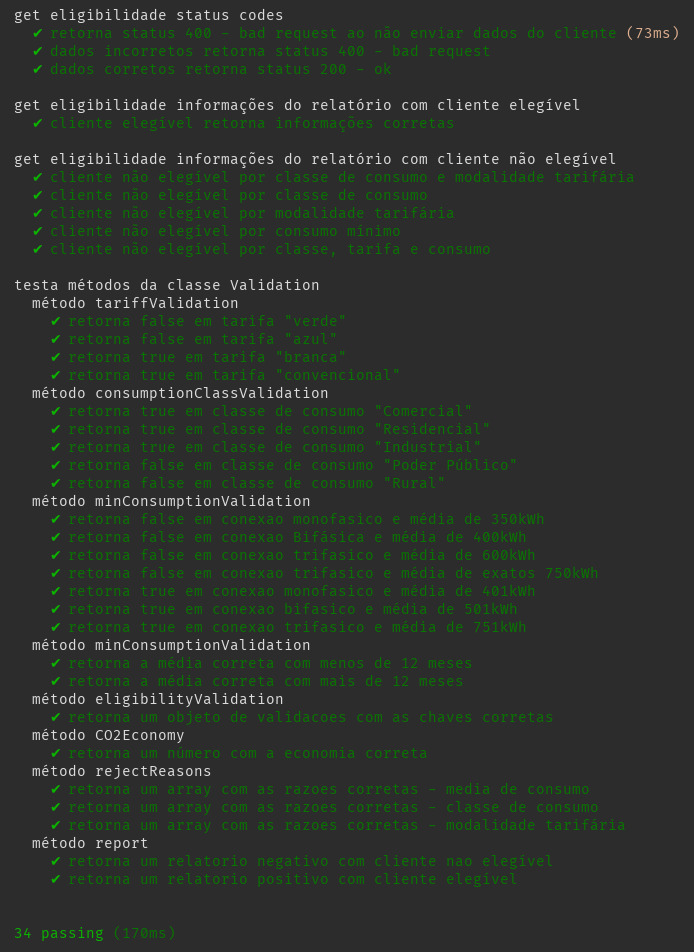

# Desafio Técnico Back-end Lemon

Essa é uma API rest para checagem de eligibilidade de aquisição de cliente. A API recebe dados referentes a conta de energia do cliente e de acordo com os dados, informa se o cliente é elegível. Caso o cliente não seja elegível, a API retorna os motivos pelos quais o cliente não é elegível, e, caso o cliente seja elegível a API retorna a projeção de quantidade de CO2 que deixaria de ser emitida ao usar energia limpa, baseando-se na média de consumo.

Projeto NodeJS, desenvolvido usando TypeScript, foi escrito testes unitário e testes de integração. Também está sendo disponibilizado a configuração para rodar o projeto em container Docker.

## Índice

- [**Stack utilizada**](#stack-utilizada)
- [**Documentação da API**](#documentação-da-api)
  - [Exemplos](#exemplos)
  - [Variáveis de Ambiente](#variáveis-de-ambiente)
- [**Rodando localmente**](#rodando-localmente)
- [**Rodando com Docker**](#rodando-com-docker)
- [**Testes**](#testes)
- [**Arquitetura**](#arquitetura)
- [**Aprendizados**](#aprendizados)


## Stack Utilizada

  - Node/Typescript
  - Express
  - Mocha
  - Chai

## Documentação da API

### Retorna o relatório referente ao cliente

```javascript
  GET /
```

Recebe um objeto body JSON com os seguintes parâmetros:

| Parâmetro   | Tipo       | Descrição                           |
| :---------- | :--------- | :---------------------------------- |
| `numeroDoDocumento` | `string` | **Obrigatório**. CPF ou CNPJ |
| `tipoDeConexao` | `string` | **Obrigatório**. `monofasico` `bifasico` `trifasico` |
| `classeDeConsumo` | `string` | **Obrigatório**. `residencial` `industrial` `comercia` `rural` `poderPublico` |
| `modalidadeTarifaria` | `string` | **Obrigatório**. `azul` `branca` `verde` `convencional` |
| `historicoDeConsumo` | `array` | **Obrigatório**. Array de Inteiros `number[]` |

#### Exemplos:

Entrada:
```json
{
  "numeroDoDocumento": "55489966157",
  "tipoDeConexao": "trifasico",
  "classeDeConsumo": "residencial",
  "modalidadeTarifaria": "convencional",
  "historicoDeConsumo": [
    3878,
    9760,
    5976
  ]
}
```

Saida:
```json
{
  "elegível": true,
  "economiaAnualDeCO2": 549.19
}
```

---

Entrada:
```json
{
  "numeroDoDocumento": "55489966157",
  "tipoDeConexao": "trifasico",
  "classeDeConsumo": "residencial",
  "modalidadeTarifaria": "verde",
  "historicoDeConsumo": [
    366,
    783,
    129
  ]
}
```

Saida:
```json
{
  "elegível": false,
  "razoesInelegibilidade": [
    "Modalidade tarifária não aceita",
    "Consumo médio não aceito"
  ]
}
```

## Variáveis de Ambiente

É possível configurar a porta em que o servidor irá rodar adicionando a seguinte variável no arquivo .env:

| Variável   | Descrição  |
| :---------- | :--------- |
| `PORT`      | Porta para o servidor ouvir |

## Rodando Localmente

**Pre-requisitos:** node, npm

Clone o projeto

```bash
  git clone git@github.com:leo606/lemon-challenge.git
```

Entre no diretório do projeto

```bash
  cd lemon-challenge
```

Instale as dependências

```bash
  npm install
```

Inicie o servidor

```bash
  npm run start
```
_Esse script irá compilar o código TypeScript e subir um servidor node (porta padrão 3001)_

## Rodando com Docker

Clone o projeto

```bash
  git clone git@github.com:leo606/lemon-challenge.git
```

Entre no diretório do projeto

```bash
  cd lemon-challenge
```

Crie a docker image

```bash
  sudo docker image build -t lemon ./
```

Crie e inicie o conteiner

```bash
  sudo docker container run -dit -p 3001:3001 --name lemon-c lemon
```
_O servidor será exposto na porta 3001_

## Testes

Foi escrito testes de integração e testes unitários para a aplicação. Foi usado as bibliotecas [mocha](https://mochajs.org), [chai](https://www.chaijs.com) para a realização dos testes.

### Cobertura de Teste:


### Testes:



## Arquitetura

O projeto foi organizado seguindo conceitos da arquitetura MSC _Model Service Controller_. Em Controller foi organizado as rotas da API e middlewares. Em Service foi feito todas as regras de negócio para a validação de eligibilidade. Não há a camada Model devido a ausência de banco de dados na aplicação.

```bash
src
├── api
│   ├── app.ts
│   └── server.ts
├── controllers
│   ├── client
│   │   └── get.ts
│   └── root.ts
├── helpers
│   └── joiSchemas.ts
├── interfaces
│   ├── Client.ts
│   ├── ErrorResponse.ts
│   └── Reports.ts
├── middlewares
│   ├── clientValidation.ts
│   └── error.ts
└── services
    └── client
        ├── clientReport.ts
        └── validations
            └── Validation.ts
```

## Lint
Foi configurado o lint usando as configurações [Airbnb](https://www.npmjs.com/package/eslint-config-airbnb)

## Aprendizados

Foi muito valioso o aprendizado adquirido com relação a Typescript e classes durante o desenvolvimento desse projeto. Existem pontos a melhorar com relação a arquitetura e organização do código, e organização de testes. Agradeço a David Gonzaga pela disponibilidade em tirar dúvidas e ajudar.


## Sobre mim

- [LinkedIn](https://www.linkedin.com/in/leonardolmf/)
- [GitHub](https://github.com/leo606)